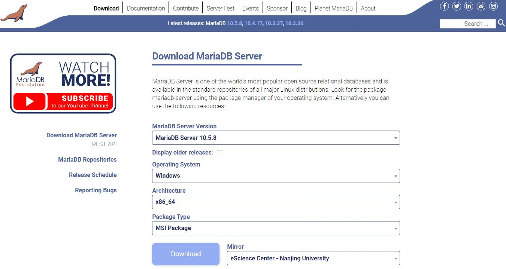
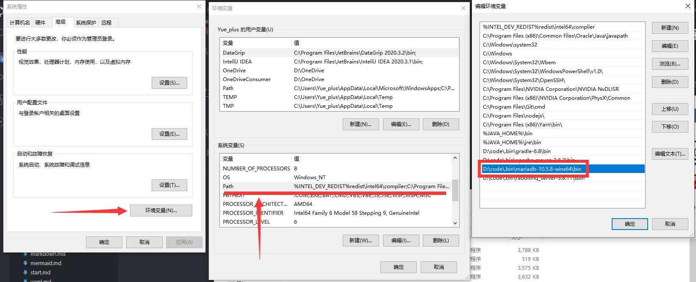

# MariaDB

::: tip
MariaDB 数据库管理系统是 MySQL 的一个分支，主要由开源社区在维护，采用 GPL 授权许可。
MariaDB 的目的是全兼容 MySQL，包括 API 与命令行，使之能轻松成为 MySQL 的代替品。

[MariaDB 官网](https://mariadb.org/)
:::

<iframe src="//player.bilibili.com/player.html?aid=83395424&bvid=BV1NJ411J79W&cid=142661514&page=3" scrolling="no" border="0" frameborder="no" framespacing="0" allowfullscreen="true" style="width: 100%; height: 380px;"> </iframe>

## 安装

### Windows

#### 使用 MSI 包安装

前往 [MariaDB 官网下载](https://mariadb.org/download/) 安装包。



点击 Download 安装下载安装。

#### 使用 ZIP 包安装

Package Type 选择 ZIP file，点击 Download 按钮下载，并解压到任意目录。

将 `\bin` 目录添加到环境变量：



配置完成后就可以使用 `mysql` 命令了。

### Debian

#### 使用 apt 包管理器安装

```sh
apt update
apt install mariadb-server
```

## 配置

### Debian - 允许外部通过 3306 端口链接

修改 `/etc/mysql/mariadb.conf.d/50-server.cnf` 文件，将第 29 行注释掉：

```diff
 # Instead of skip-networking the default is now to listen only on
 # localhost which is more compatible and is not less secure.
-bind-address          = 127.0.0.1
+# bind-address          = 127.0.0.1
```