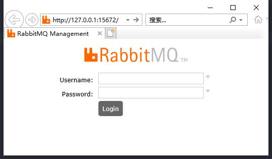

# RabbitMQ

:::tip
RabbitMQ 是实现了高级消息队列协议（AMQP）的开源消息代理软件（亦称面向消息的中间件）。
RabbitMQ 服务器是用 [Erlang](https://www.erlang.org/) 语言编写的，而集群和故障转移是构建在[开放电信平台](https://baike.baidu.com/item/开放电信平台)框架上的。
所有主要的编程语言均有与代理接口通讯的客户端库。

[RabbitMQ 官方网站](https://www.rabbitmq.com/)
:::

<iframe src="//player.bilibili.com/player.html?aid=95396959&bvid=BV1dE411K7MG&cid=163004929&page=1" scrolling="no" border="0" frameborder="no" framespacing="0" allowfullscreen="true" style="width: 100%; height: 380px;"> </iframe>

## 安装

推荐参考官方教程（英文）：
- [下载与安装 RabbitMQ](https://www.rabbitmq.com/download.html)
- [在 Debian 或 Ubuntu 中安装 RabbitMQ](https://www.rabbitmq.com/install-debian.html)

### Debian

下载最新 deb 软件包：
- [ErLang](https://www.erlang-solutions.com/resources/download.html#tabs-debian)
- [RabbitMQ](https://packagecloud.io/rabbitmq/rabbitmq-server)

将 `.deb` 软件包上传到 Debian 主机，或在主机上使用 `wget` 指令下载软件包：

```sh
wget https://packages.erlang-solutions.com/erlang/debian/pool/esl-erlang_23.2.1-1~debian~stretch_amd64.deb
wget --content-disposition https://packagecloud.io/rabbitmq/rabbitmq-server/packages/ubuntu/disco/rabbitmq-server_3.8.11-1_all.deb/download.deb
```

执行以下指令安装 ErLang 与 RabbitMQ：

```sh
sudo dpkg --install esl-erlang_23.2.1-1~debian~stretch_amd64.deb
sudo dpkg --install rabbitmq-server_3.8.11-1_all.deb
```

通过插件开启 Web 管理界面，并重启 RabbitMQ 服务：

```sh
sudo rabbitmq-plugins enable rabbitmq_management
sudo systemctl restart rabbitmq-server.service
```

现在可以通过浏览器访问 <http://localhost:15672> 访问 Web 管理界面。



> 现代浏览器可能会强制使用 https 链接，可参考 [配置 > 配置 SSL（https）](#配置-ssl-https)或暂时使用 IE 浏览器。

参考 [配置 > 配置管理员账户](#配置管理员账户)

## 配置

### 配置管理员账户

1. 添加用户：

   ```sh
   sudo rabbitmqctl add_user <用户名> <密码>
   ```

   [查看 `rabbitmqctl add_user` 命令](https://www.rabbitmq.com/rabbitmqctl.8.html#add_user)

2. 添加用户标签：
   - none     无标签
   - management     管理员
   - monitoring     监控员
   - administrator    超级管理员

   ```sh
   sudo rabbitmqctl set_user_tags <用户名> administrator
   ```

   [查看 `rabbitmqctl set_user_tags` 命令](https://www.rabbitmq.com/rabbitmqctl.8.html#set_user_tags)

3. 赋予所有权限：

   ```sh
   sudo rabbitmqctl set_permissions -p / <用户名> ".*" ".*" ".*"
   ```

   [查看 `rabbitmqctl set_permissions` 命令](https://www.rabbitmq.com/rabbitmqctl.8.html#add_user)

## 配置 SSL（https）

建议参考官方文档 [TLS 支持（英文）](https://www.rabbitmq.com/ssl.html)

## 常用指令

:::tip
[RebbitMQ 手册页面](https://www.rabbitmq.com/manpages.html)
:::

### `rabbitmqctl status`

查询当前 RabbitMQ 状态

```textStatus of node rabbit@VM-0-5-debian ...
Runtime

OS PID: 457
OS: Linux
Uptime (seconds): 178
Is under maintenance?: false
RabbitMQ version: 3.8.11
Node name: rabbit@VM-0-5-debian
Erlang configuration: Erlang/OTP 23 [erts-11.1.5] [source] [64-bit] [smp:1:1] [ds:1:1:10] [async-threads:1] [hipe]
Erlang processes: 441 used, 1048576 limit
Scheduler run queue: 1
Cluster heartbeat timeout (net_ticktime): 60

Plugins

Enabled plugin file: /etc/rabbitmq/enabled_plugins
Enabled plugins:

 * rabbitmq_management
 * amqp_client
 * rabbitmq_web_dispatch
 * cowboy
 * cowlib
 * rabbitmq_management_agent

Data directory

Node data directory: /var/lib/rabbitmq/mnesia/rabbit@VM-0-5-debian
Raft data directory: /var/lib/rabbitmq/mnesia/rabbit@VM-0-5-debian/quorum/rabbit@VM-0-5-debian

Config files


Log file(s)

 * /var/log/rabbitmq/rabbit@VM-0-5-debian.log
 * /var/log/rabbitmq/rabbit@VM-0-5-debian_upgrade.log

Alarms

(none)

Memory

Total memory used: 0.0965 gb
Calculation strategy: rss
Memory high watermark setting: 0.4 of available memory, computed to: 0.3642 gb

code: 0.033 gb (34.25 %)
other_proc: 0.0319 gb (33.06 %)
other_system: 0.0126 gb (13.05 %)
allocated_unused: 0.0066 gb (6.87 %)
reserved_unallocated: 0.0057 gb (5.93 %)
other_ets: 0.0033 gb (3.43 %)
atom: 0.0015 gb (1.51 %)
plugins: 0.0013 gb (1.39 %)
mgmt_db: 0.0002 gb (0.16 %)
binary: 0.0001 gb (0.14 %)
mnesia: 0.0001 gb (0.09 %)
metrics: 0.0001 gb (0.07 %)
msg_index: 0.0 gb (0.03 %)
quorum_ets: 0.0 gb (0.02 %)
connection_other: 0.0 gb (0.0 %)
connection_channels: 0.0 gb (0.0 %)
connection_readers: 0.0 gb (0.0 %)
connection_writers: 0.0 gb (0.0 %)
queue_procs: 0.0 gb (0.0 %)
queue_slave_procs: 0.0 gb (0.0 %)
quorum_queue_procs: 0.0 gb (0.0 %)

File Descriptors

Total: 2, limit: 32671
Sockets: 0, limit: 29401

Free Disk Space

Low free disk space watermark: 0.05 gb
Free disk space: 45.1227 gb

Totals

Connection count: 0
Queue count: 0
Virtual host count: 1

Listeners

Interface: [::], port: 15672, protocol: http, purpose: HTTP API
Interface: [::], port: 25672, protocol: clustering, purpose: inter-node and CLI tool communication
Interface: [::], port: 5672, protocol: amqp, purpose: AMQP 0-9-1 and AMQP 1.0
```

### `rabbitmq-plugins list`

查询当前插件配置/状态

```text
 配置：E = 显示启用；e = 隐式启用
 | 状态：* = 运行于 rabbit@VM-0-5-debian
 |/
[e*] amqp_client                       3.6.6
[  ] cowboy                            1.0.3
[  ] cowlib                            1.0.1
[e*] mochiweb                          2.13.1
[  ] rabbitmq_amqp1_0                  3.6.6
[  ] rabbitmq_auth_backend_ldap        3.6.6
[  ] rabbitmq_auth_mechanism_ssl       3.6.6
[  ] rabbitmq_consistent_hash_exchange 3.6.6
[  ] rabbitmq_event_exchange           3.6.6
[  ] rabbitmq_federation               3.6.6
[  ] rabbitmq_federation_management    3.6.6
[  ] rabbitmq_jms_topic_exchange       3.6.6
[E*] rabbitmq_management               3.6.6
[e*] rabbitmq_management_agent         3.6.6
[  ] rabbitmq_management_visualiser    3.6.6
[  ] rabbitmq_mqtt                     3.6.6
[  ] rabbitmq_recent_history_exchange  1.2.1
[  ] rabbitmq_sharding                 0.1.0
[  ] rabbitmq_shovel                   3.6.6
[  ] rabbitmq_shovel_management        3.6.6
[  ] rabbitmq_stomp                    3.6.6
[  ] rabbitmq_top                      3.6.6
[  ] rabbitmq_tracing                  3.6.6
[  ] rabbitmq_trust_store              3.6.6
[e*] rabbitmq_web_dispatch             3.6.6
[  ] rabbitmq_web_stomp                3.6.6
[  ] rabbitmq_web_stomp_examples       3.6.6
[  ] sockjs                            0.3.4
[e*] webmachine                        1.10.3
```
