# Ubuntu

::: tip
Ubuntu 是适用于企业服务器、桌面电脑、云、IoT 物联网的现代化开源Linux操作系统。

[官网](https://ubuntu.com/)
[中文官网](https://cn.ubuntu.com/)
:::

## 安装

- 从系统安装光盘或U盘启动系统：
  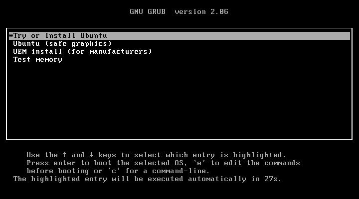
  
- 启动成功后，在左边选择简体中文语言（最下面），然后点击试用：
  
- 这时可以调整一下屏幕分辨率方便后续操作：
  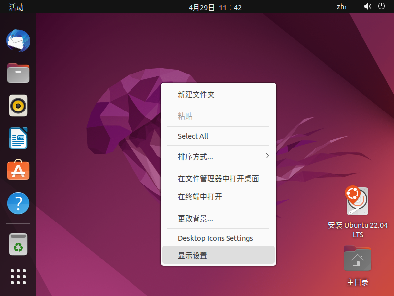
  
- 然后双击桌面的 **安装 Ubuntu** 图标，进入安装流程：
  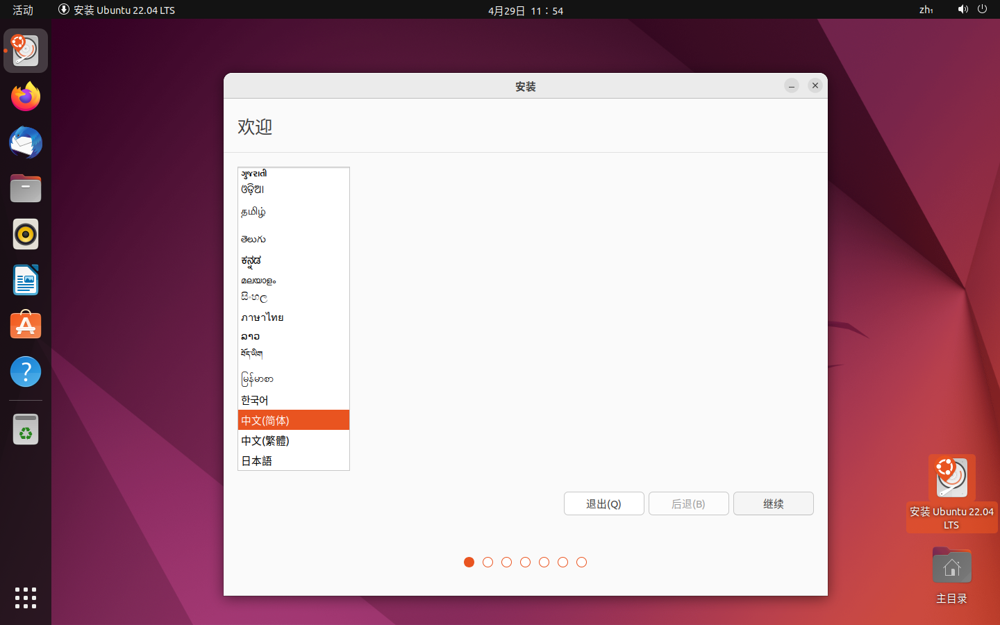
  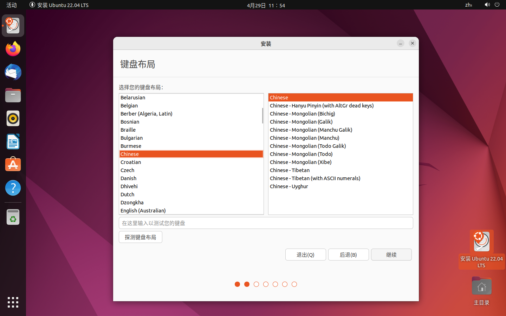
  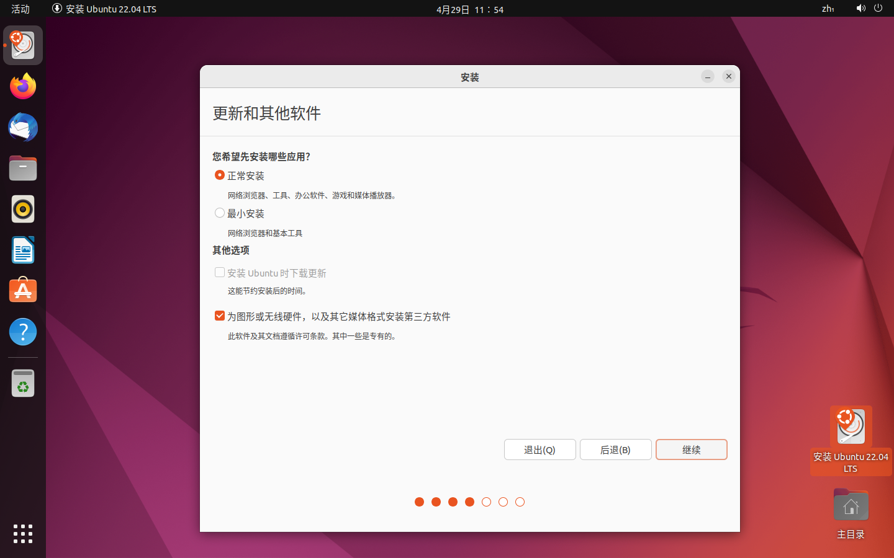
  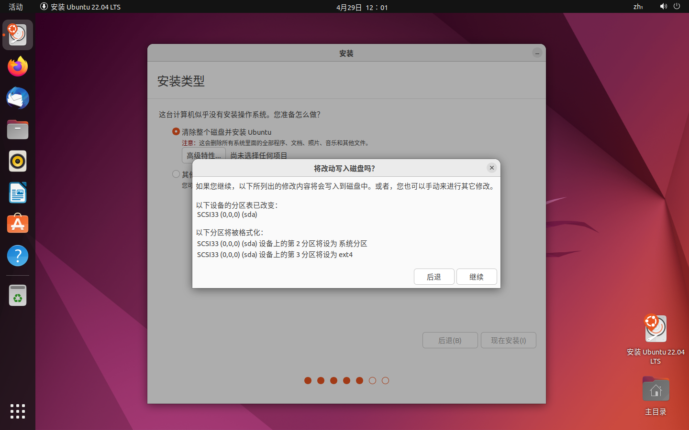
  
  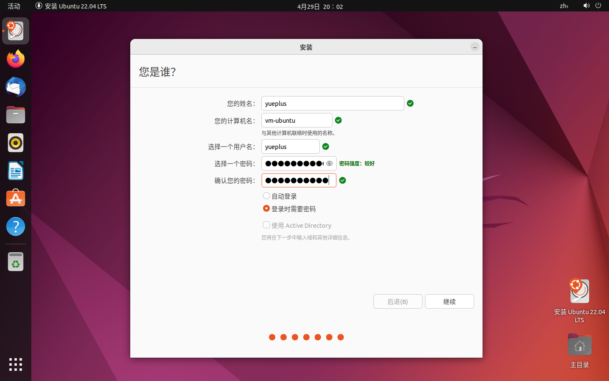
  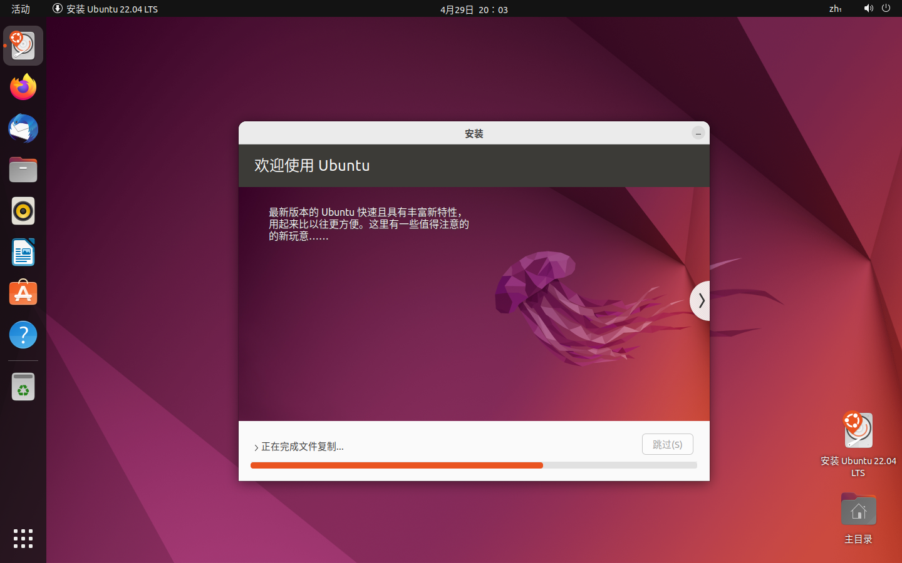
  
  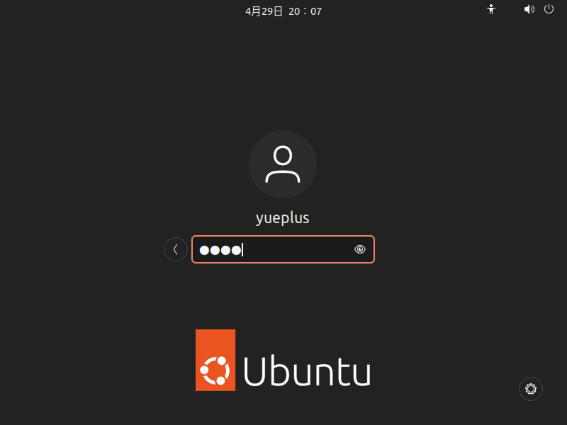
- 首次进入系统展示欢迎页，按需选择即可：
  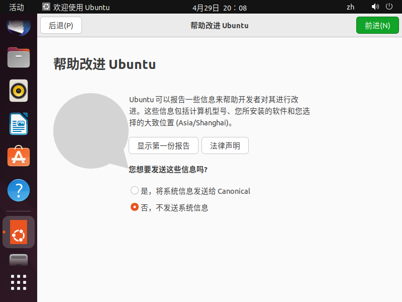
  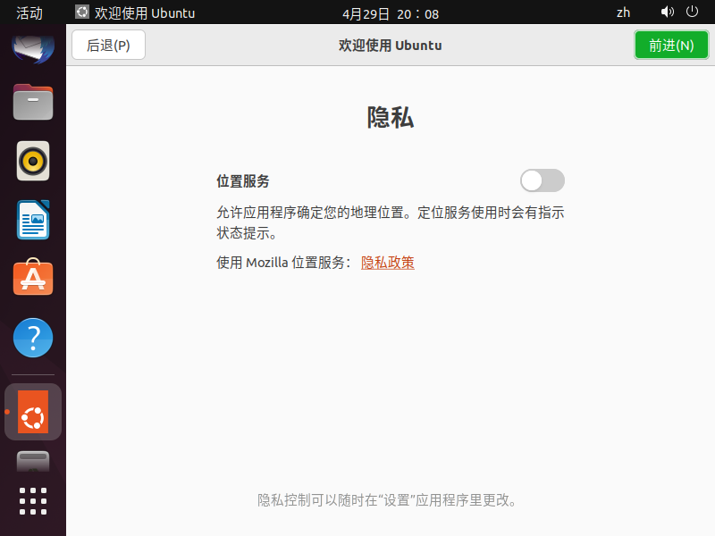
  
- 系统安装成功：
  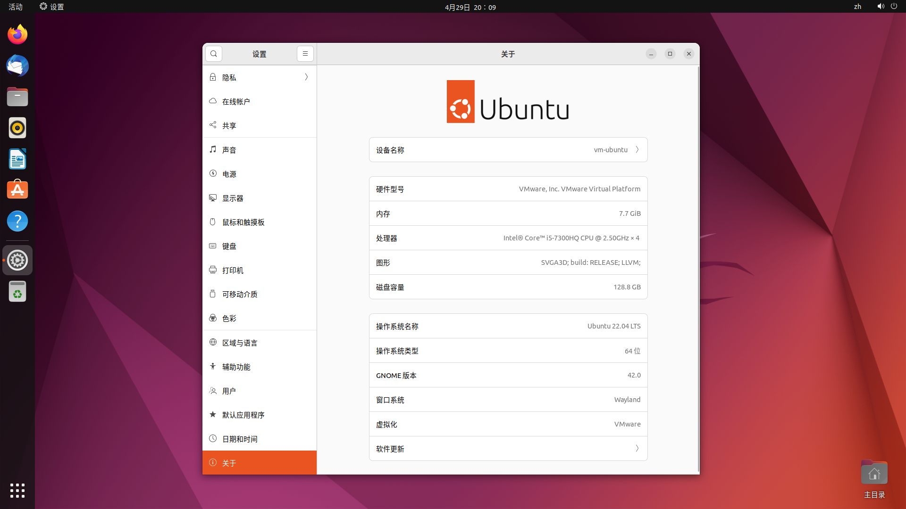

## 配置软件源

软件源配置通常存放在 `/etc/apt/sources.list` 文件内。

先备份源文件：

```bash
cd /etc/apt/
sudo cp sources.list sources.list.bak
```

然后配置需要的软件源

### [阿里巴巴开源镜像站 - Ubuntu](https://developer.aliyun.com/mirror/ubuntu)

以下配置适用 **Ubuntu 22.04 LTS**：

```text
deb http://mirrors.aliyun.com/ubuntu/ jammy main restricted
deb-src http://mirrors.aliyun.com/ubuntu/ jammy universe main multiverse restricted
deb http://mirrors.aliyun.com/ubuntu/ jammy-updates main restricted
deb-src http://mirrors.aliyun.com/ubuntu/ jammy-updates universe main multiverse restricted
deb http://mirrors.aliyun.com/ubuntu/ jammy universe
deb http://mirrors.aliyun.com/ubuntu/ jammy-updates universe
deb http://mirrors.aliyun.com/ubuntu/ jammy multiverse
deb http://mirrors.aliyun.com/ubuntu/ jammy-updates multiverse
deb http://mirrors.aliyun.com/ubuntu/ jammy-backports main restricted universe multiverse
deb-src http://mirrors.aliyun.com/ubuntu/ jammy-backports main restricted universe multiverse
deb http://mirrors.aliyun.com/ubuntu/ jammy-security main restricted
deb-src http://mirrors.aliyun.com/ubuntu/ jammy-security universe main multiverse restricted
deb http://mirrors.aliyun.com/ubuntu/ jammy-security universe
deb http://mirrors.aliyun.com/ubuntu/ jammy-security multiverse
```

### [腾讯软件源](https://mirrors.cloud.tencent.com/)

以下配置适用 **Ubuntu 22.04 LTS**：

```text
deb-src https://mirrors.cloud.tencent.com/ubuntu/ jammy main restricted #Added by software-properties
deb https://mirrors.cloud.tencent.com/ubuntu/ jammy main restricted
deb-src https://mirrors.cloud.tencent.com/ubuntu/ jammy universe multiverse #Added by software-properties
deb https://mirrors.cloud.tencent.com/ubuntu/ jammy-updates main restricted
deb-src https://mirrors.cloud.tencent.com/ubuntu/ jammy-updates universe main multiverse restricted #Added by software-properties
deb https://mirrors.cloud.tencent.com/ubuntu/ jammy universe
deb https://mirrors.cloud.tencent.com/ubuntu/ jammy-updates universe
deb https://mirrors.cloud.tencent.com/ubuntu/ jammy multiverse
deb https://mirrors.cloud.tencent.com/ubuntu/ jammy-updates multiverse
deb https://mirrors.cloud.tencent.com/ubuntu/ jammy-backports main restricted universe multiverse
deb-src https://mirrors.cloud.tencent.com/ubuntu/ jammy-backports main restricted universe multiverse #Added by software-properties
deb https://mirrors.cloud.tencent.com/ubuntu/ jammy-security main restricted
deb-src https://mirrors.cloud.tencent.com/ubuntu/ jammy-security universe main multiverse restricted #Added by software-properties
deb https://mirrors.cloud.tencent.com/ubuntu/ jammy-security universe
deb https://mirrors.cloud.tencent.com/ubuntu/ jammy-security multiverse
```

### [清华大学开源软件镜像站](https://mirrors.tuna.tsinghua.edu.cn/)

### [网易开源镜像站](http://mirrors.163.com/)

### 桌面版 (Desktop)

安装了桌面环境可以使用 **软件更新器** 自动选择软件源：


## 安装 `open-vm-tools-desktop`

如果在 VMware 虚拟机中安装，建议使用 `open-vm-tools-desktop` 替代 VMware Tools：

```bash
sudo apt update
sudo apt install open-vm-tools
```

## 安装中文语言包

```sh
sudo apt install language-pack-zh-hans manpages-zh -y
localectl set-locale LANG=zh_CN.UTF-8 LANGUAGE=zh_CN.UTF-8
```

## 安装 oh my zsh

参考：[Oh My Zsh - a delightful & open source framework for Zsh](https://ohmyz.sh/)

```sh
sudo apt install zsh
sh -c "$(curl -fsSL https://raw.githubusercontent.com/ohmyzsh/ohmyzsh/master/tools/install.sh)"
```

## 安装 vim

```bash
sudo apt install vim
```

## 安装 git

```bash
sudo apt install git
```

## 安装 `screenfetch`

可以字符画展示系统信息。

```bash
sudo apt install screenfetch
```

## 安装搜狗拼音输入法

  [搜狗拼音输入法 Linux 版](https://pinyin.sogou.com/linux)
| [Ubuntu 搜狗输入法安装指南](https://pinyin.sogou.com/linux/guide)
