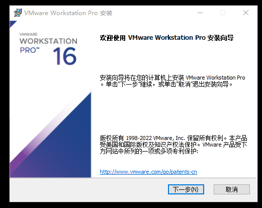
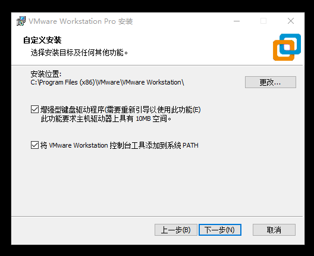
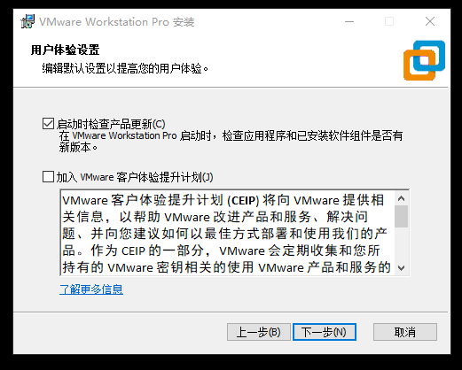
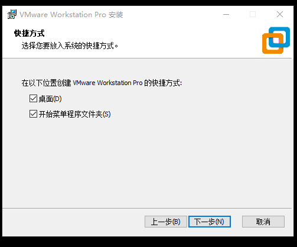
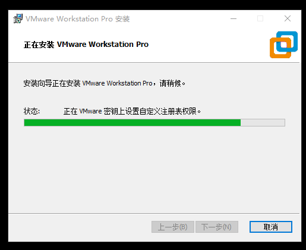
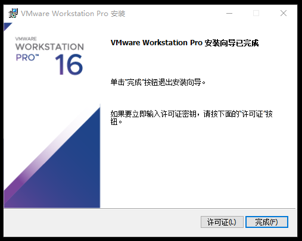
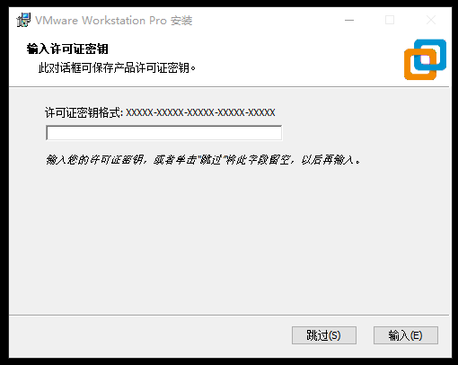
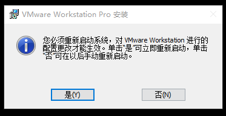

# VMware Workstation 虚拟机平台

::: tip
VMware Workstation Pro 是行业标准桌面 Hypervisor。
使用它可在 Windows 或 Linux 桌面上运行 Windows、Linux 和 BSD 虚拟机。

[官方网站](https://www.vmware.com/cn/products/workstation-pro.html)
:::

## 什么是虚拟机

- 虚拟机是指通过软件模拟出来、具有完整硬件功能的计算机。
- 虚拟机以文件的形式存储在物理机系统的磁盘中，虚拟机上的多数操作都不影响物理机的使用。
- 虚拟机能够添加、修改和删除硬件，除此之外，他还能够安装操作系统与应用程序，具备连接网络等功能。

- 虚拟机技术的出现节约了企业计算机的资金投入，通过虚拟机平台软件可在一台物理机上模拟出多台计算机，为实现更为复杂的网络应用和实验环境提供了便利。
- 虚拟机以文件形式存储的特性使其能够快速的转移，可将轻松将虚拟机转移到其他计算机上使用，减少了企业因更换硬件设备造成的重新部署时间。他还能够按需创建快照（某一时刻的系统状态，即还原点），在必要时进行恢复。 

## VMware Workstation 虚拟机平台介绍

- VMware Workstation 是 VMware 公司推出的一款功能强大的桌面虚拟机软件。
- 可在运行该软件的计算机上安装、配置和使用多台虚拟机，支持 Windows、MAC OS、Linux 等常见操作系统。
- VMware Workstation 以其良好的口碑以及对 VMware 公司其他产品良好的支持，得到了广泛应用。 

## 安装 VMware

前往下载 [VMware Workstation Pro](https://www.vmware.com/cn/products/workstation-pro/workstation-pro-evaluation.html) 

下载完后打开安装包进入安装向导，并安装向导提示开始安装，安装过程中请耐心等待：









安装完成输入产品许可证密钥(不输入视为试用）：



VMware Workstation 虚拟机平台安装完成：




## 选择自定义安装虚拟机


打开VMware 选择安装虚拟机
 

```
 选择自定义安装
 
 选择虚拟机硬件兼容性（默认不修改）
 
 稍后安装操作系统>选择自己需要安装的虚拟机版本
 
 设置虚拟机名称和安装位置

 设置所需虚拟机cup参数，运行内存

 设置自己虚拟机所需的网络类型

 I/O控制器类型，选择磁盘类型选择推荐值，创建新虚拟磁盘，设置虚拟磁盘内存，设置磁盘位置

 ```

 选择自定义硬件


   

 
 放入自己需要安装系统的镜像文件

 ## VMware Tools

 ### Ubuntu

 建议使用 `open-vm-tools-desktop` 替代 VMware Tools，参考：
 [Ubuntu 安装 open-vm-tools-desktop](/serve/Ubuntu/#安装-open-vm-tools-desktop)


