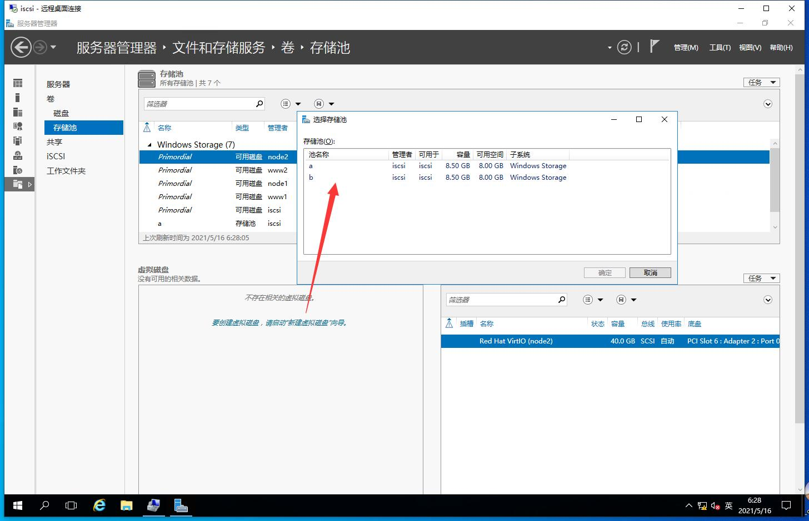
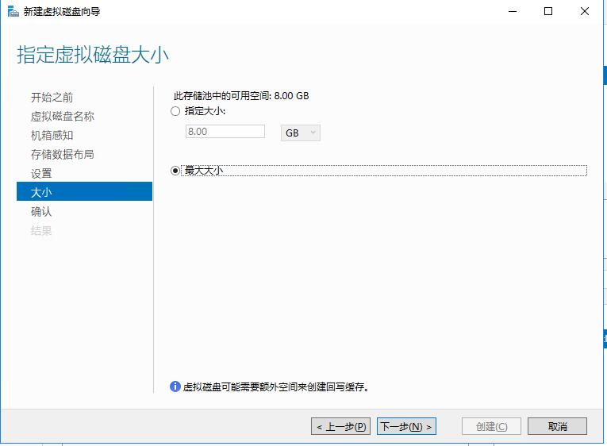
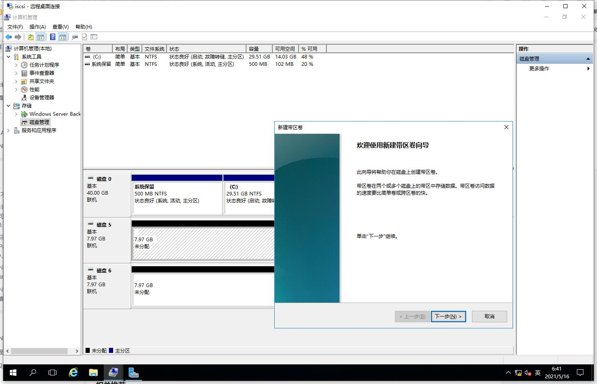
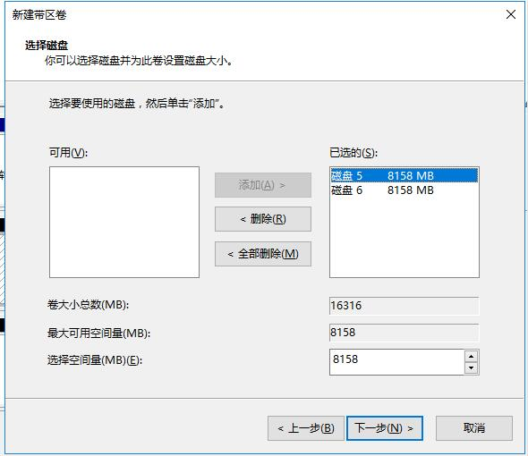
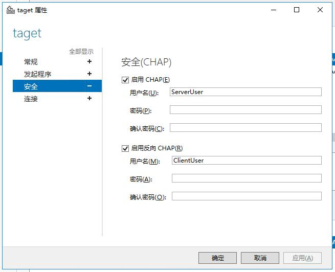
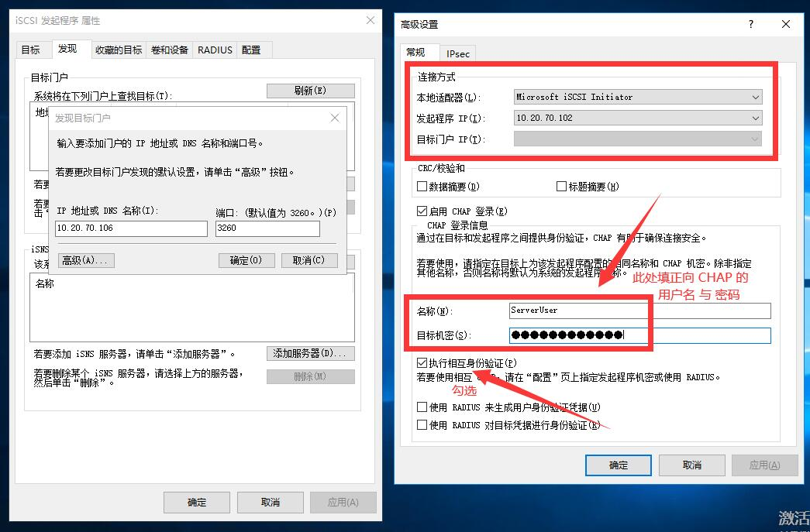

# 文件和储存服务

::: tip
Windows Server 中的存储为专注虚拟化工作负载的软件定义数据中心 (SDDC) 客户提供了新的和改进的功能。
Windows Server 还为使用文件服务器处于现有工作负荷的企业客户提供广泛的支持。

[Windows Server 存储文档 | Microsoft Docs](https://docs.microsoft.com/zh-cn/windows-server/storage/storage)
:::

## 基本磁盘管理

Windows 10 右键 **此电脑** -> **管理** -> **储存** -> **磁盘管理**

Windows Server 点击 **服务器管理器** 右上角的 *工具* -> **计算机管理** -> **储存** -> **磁盘管理**

[磁盘管理概述 | Microsoft Docs](https://docs.microsoft.com/zh-cn/windows-server/storage/disk-management/overview-of-disk-management)

## 配置储存池

## 配置 RAID 10

参考：
- [2020中职网搭国赛 故障转移群集配置_哔哩哔哩 (゜-゜)つロ 干杯~-bilibili](https://www.bilibili.com/video/BV1h54y1j7zS)
  [00:00 ~ 01:39]
- [Windows磁盘管理、动态磁盘、RAID10_razorx的博客-CSDN博客](https://blog.csdn.net/weixin_42747982/article/details/83685711)
- [RAID0 RAID1 RAID5 RAID10区别_c1052981766的专栏-CSDN博客](https://blog.csdn.net/c1052981766/article/details/49612793)

RAID 10 至少需要使用 4 块硬盘。

先新建两个储存池（两个硬盘组一个储存池）：

然后从储存池创建虚拟磁盘：

**选择储存数据布局** 选择 `Simple`（简单，也就是带区卷，`RAID 0`）：

**指定虚拟磁盘大小** 选择 **最大大小**：

建立完两个虚拟磁盘后，**计算机管理** -> **储存** -> **磁盘管理** 内应该有两个未分配的磁盘。
右键其中一个 **新建带区卷**（`RAID 1`）：

添加另一块未分配的磁盘

接下来分配驱动器号；
格式化卷时：
  文件系统：`NTFS`；
  分配单元大小：`4096`；
  勾选 **执行快速格式化**

> Yue_plus: 是的，没错。`RAID 1` + `RAID 0` = `RAID 10`。23333

## 配置 iSCSI

### 什么是 iSCSI？

- [iSCSI 目标服务器概述 | Microsoft Docs](https://docs.microsoft.com/zh-cn/windows-server/storage/iscsi/iscsi-target-server)
- [iSCSI的基本架构及操作简介 - 知乎](https://zhuanlan.zhihu.com/p/60986068)
- [iSCSI_百度百科](https://baike.baidu.com/item/iSCSI/2169135?fr=aladdin)

### 新建 iSCSI 虚拟磁盘

### 新建 iSCSI 目标

### iSCSI 发起程序

## 配置 CHAP 双向认证

在 [新建 iSCSI 目标](#新建-iscsi-目标) 时可以配置 CHAP 身份验证；
也可以在 iSCSI 目标属性中更改认证密码。

### 连接时

如果开启了 **反向 CHAP** 认证，连接时需要到 **配置** 选项卡中设置反向 CHAP 密码：

